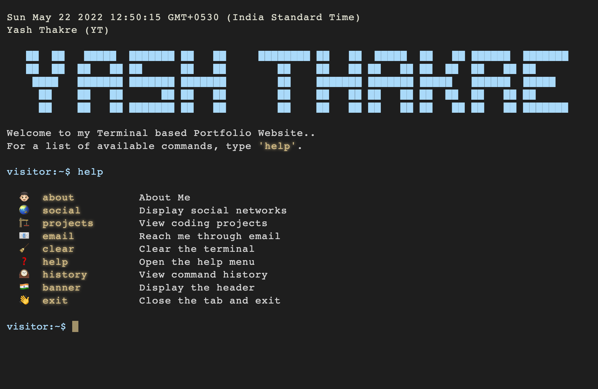

# Terminal Portfolio Website

The terminal is something almost all programmers use. So it makes sense
to make a portfolio website that looks like a Terminal. 

The entire project is implemented
using basic web technologies (HTML, CSS and Vanilla JS) which is later hosted on Heroku.

Feel free to explore the website and its code!

Website link: [Yash Thakre Terminal Portfolio](https://bit.ly/thakreyn-tportfolio)

## Preview:

